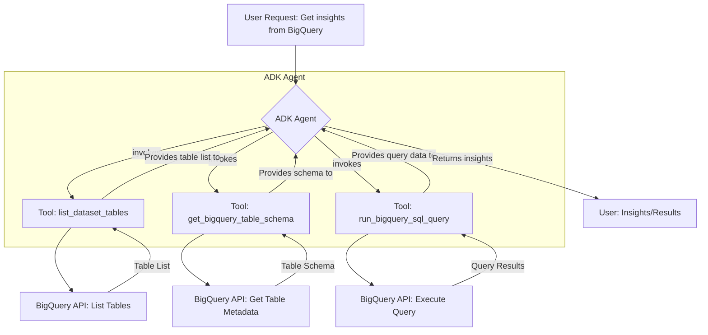

# Plan for ADK Agent with BigQuery Integration

This document outlines the plan for creating an Agent Development Kit (ADK) agent capable of interacting with Google BigQuery to list tables, retrieve schemas, and execute SQL queries.

## I. ADK Agent Definition

The core of the solution will be an ADK agent defined in Python.

*   **Implementation:** Using the `Agent` class from `google.adk.agents`.
*   **Configuration:**
    *   **Name:** `BigQueryAssistant` (or similar)
    *   **Model:** A suitable Gemini model (e.g., "gemini-2.0-flash" or user-preferred).
    *   **Instruction Prompt:** "You are an assistant that can query Google BigQuery. Use the available tools to list tables, get table schemas, and execute SQL queries to answer user requests."
    *   **Description:** "An agent that fetches data and schema from BigQuery and runs SQL queries."
    *   **Tools:** A list of custom Python functions (detailed below) that will handle the BigQuery interactions.

## II. BigQuery Python Client

Interaction with BigQuery will be managed using the `google-cloud-bigquery` Python library.

*   A `bigquery.Client()` instance will be initialized and utilized by the agent's tools to communicate with the BigQuery API.
*   Authentication is assumed to be handled via standard Google Cloud environment setup (e.g., ADC, service account).

## III. Agent Tools (Python Functions)

The following Python functions will be developed and registered as tools for the ADK agent:

### 1. `list_dataset_tables(project_id: str, dataset_id: str) -> list[str]`

*   **Purpose:** Lists all tables within a specified BigQuery project and dataset.
*   **Inputs:**
    *   `project_id: str` - The Google Cloud project ID.
    *   `dataset_id: str` - The BigQuery dataset ID.
*   **Steps:**
    1.  Initialize `bigquery.Client()`.
    2.  Construct the full dataset identifier (e.g., `f"{project_id}.{dataset_id}"`).
    3.  Call `client.list_tables(full_dataset_id)` to get an iterator of table objects.
    4.  Extract the `table_id` from each table object.
    5.  Return a list of table ID strings.
    6.  Implement error handling (e.g., dataset not found, permissions issues).
*   **Return:** A list of table name strings.

### 2. `get_bigquery_table_schema(project_id: str, dataset_id: str, table_id: str) -> list[dict]`

*   **Purpose:** Retrieves the schema (column names, types, modes) of a specific BigQuery table.
*   **Inputs:**
    *   `project_id: str` - The Google Cloud project ID.
    *   `dataset_id: str` - The BigQuery dataset ID.
    *   `table_id: str` - The BigQuery table ID.
*   **Steps:**
    1.  Initialize `bigquery.Client()`.
    2.  Construct the full table identifier (e.g., `f"{project_id}.{dataset_id}.{table_id}"`).
    3.  Call `client.get_table(full_table_id)` to fetch the `Table` object.
    4.  Access the `table.schema` attribute (a list of `SchemaField` objects).
    5.  For each `SchemaField`, create a dictionary (e.g., `{'name': field.name, 'type': field.field_type, 'mode': field.mode}`).
    6.  Return a list of these schema field dictionaries.
    7.  Implement error handling (e.g., table not found, permissions issues).
*   **Return:** A list of dictionaries, where each dictionary represents a field in the table schema.

### 3. `run_bigquery_sql_query(query: str) -> list[dict]`

*   **Purpose:** Executes a given SQL query against BigQuery and returns the results.
*   **Inputs:**
    *   `query: str` - The SQL query string to execute.
*   **Steps:**
    1.  Initialize `bigquery.Client()`.
    2.  Call `client.query(query)` to submit the query, obtaining a `QueryJob`.
    3.  Call `query_job.result()` to wait for completion and get a `RowIterator`.
    4.  Iterate through the `RowIterator`, converting each `Row` object into a dictionary (e.g., `dict(row)`).
    5.  Return a list of these row dictionaries.
    6.  Implement error handling for query syntax errors, execution failures, etc.
*   **Return:** A list of dictionaries, where each dictionary represents a row from the query result.

## IV. Agent Workflow Visualization

The following Mermaid diagram illustrates the conceptual data flow and component interaction:

## V. Implementation Phase

Once this plan is approved, the next step is to switch to a development/coding mode to implement the Python code for the ADK agent and its associated BigQuery tools.